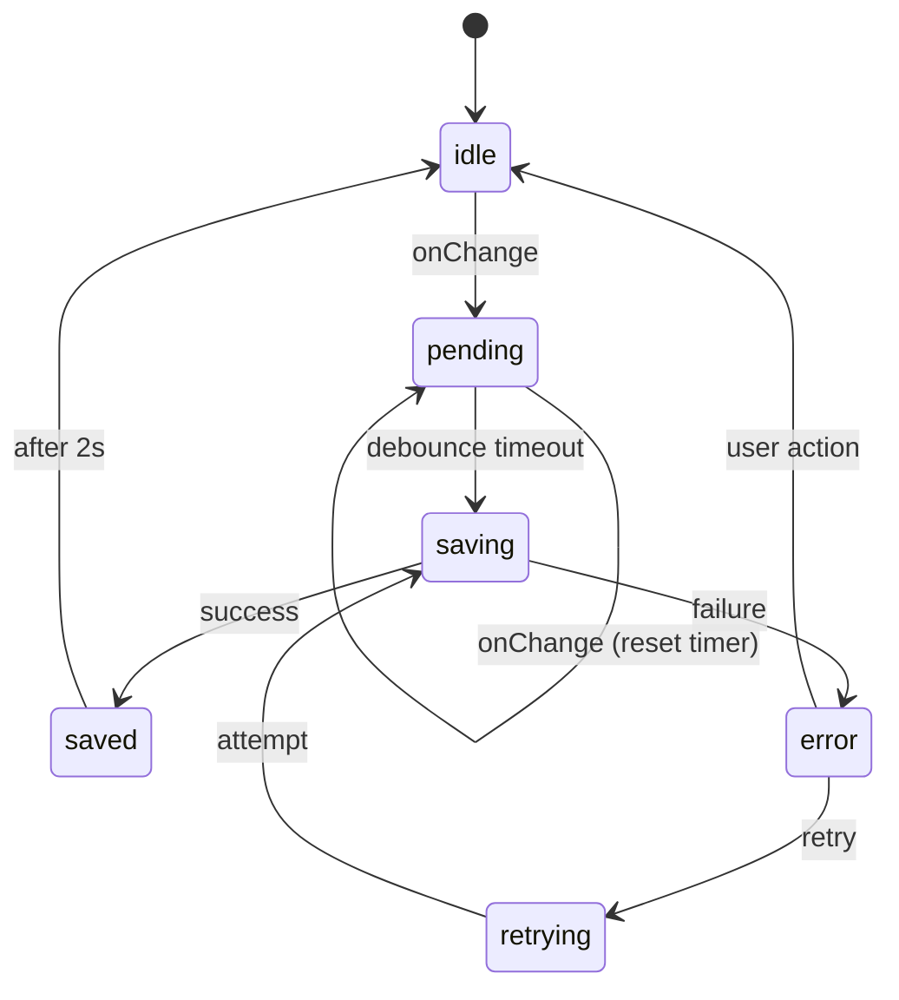
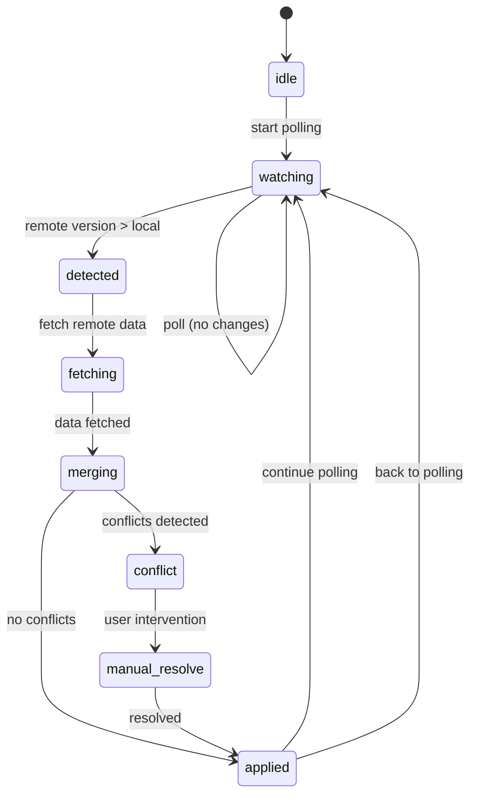

# Plano de Sistema de Sincronização Bidirecional - WebDraw

## 🎯 Objetivo

Criar um sistema de sincronização robusto, type-safe e plugável que gerencia tanto **mudanças locais → remotas** (auto-save) quanto **mudanças remotas → locais** (watcher/polling), integrado com Zustand e DECONFIG API.

## 🔧 Arquitetura

### Componentes Principais

#### 🔄 Sistema Local → Remote (Auto-Save)
1. **SyncManager** - Classe central de gerenciamento de saves locais
2. **SyncStore** - Estado Zustand dedicado ao sync
3. **SyncStatus** - Types e estados de sincronização
4. **Debounce System** - Sistema de debounce integrado
5. **UI Indicators** - Componentes de status visual

#### 👁️ Sistema Remote → Local (Watcher) - FUTURO
6. **WatchManager** - Classe para detectar mudanças remotas
7. **PollingStrategy** - Estratégia de polling configurável
8. **ConflictResolver** - Resolver conflitos entre versões
9. **MergeEngine** - Engine para merge inteligente de mudanças
10. **RemoteChangeIndicator** - UI para mudanças remotas detectadas

## 📋 Requisitos

- ✅ Type-safe em todos os níveis
- ✅ Evitar useEffects desnecessários
- ✅ Debounce configurável
- ✅ Status visual em tempo real
- ✅ Plugável e extensível
- ✅ Integração com DECONFIG API
- ✅ Retry automático em falhas
- ✅ Queue de operações
- ✅ Conflict resolution

## 🏗️ Estrutura de Arquivos

```
view/src/lib/
└── sync/
    ├── index.ts              # Exports principais
    ├── sync-manager.ts       # Classe principal SyncManager
    ├── sync-store.ts         # Zustand store para sync
    ├── sync-types.ts         # Types e interfaces
    └── sync-components.tsx   # Componentes UI de status
```

## 📊 Estado de Sincronização

### Estados Locais → Remote (Auto-Save)
```typescript
type SyncStatus = 
  | 'idle'          // Nenhuma operação pendente
  | 'pending'       // Mudanças detectadas, aguardando debounce
  | 'saving'        // Salvando no servidor
  | 'saved'         // Salvo com sucesso (transitório)
  | 'error'         // Erro ao salvar
  | 'retrying'      // Tentando novamente
  | 'conflict'      // Conflito detectado

interface SyncState {
  status: SyncStatus;
  lastSaved: Date | null;
  lastError: string | null;
  retryCount: number;
  pendingChanges: boolean;
  isOnline: boolean;
}
```

### Estados Remote → Local (Watcher) - FUTURO
```typescript
type WatchStatus =
  | 'idle'          // Sem mudanças remotas
  | 'watching'      // Monitorando mudanças remotas
  | 'detected'      // Mudança remota detectada
  | 'fetching'      // Buscando versão remota
  | 'merging'       // Fazendo merge das mudanças
  | 'applied'       // Mudanças aplicadas (transitório)
  | 'conflict'      // Conflito requer intervenção manual
  | 'error';        // Erro ao buscar/aplicar

interface WatchState {
  status: WatchStatus;
  remoteVersion: number;
  localVersion: number;
  lastChecked: Date | null;
  lastRemoteChange: Date | null;
  conflictData?: {
    localChanges: DrawingData;
    remoteChanges: DrawingData;
    baseVersion: number;
  };
}

interface BidirectionalSyncState extends SyncState {
  // Estados de watcher
  watch: WatchState;
  
  // Controle geral
  isCollaborating: boolean;
  collaborators: string[];
  
  // Configurações
  pollingEnabled: boolean;
  pollingInterval: number;
}
```

## 🔄 Fluxo de Sincronização

### Local → Remote (Auto-Save)


### Remote → Local (Watcher) - FUTURO


## 👁️ Sistema de Watcher (Futuro)

### Estratégias de Detecção

1. **Polling por Versão**: Verifica `drawing.version` periodicamente
2. **Metadata Polling**: Verifica apenas `updatedAt` dos metadados
3. **WebSocket** (ideal): Notificações push em tempo real
4. **Server-Sent Events**: Alternativa ao WebSocket

### Configuração do Watcher

```typescript
interface WatchConfig {
  // Estratégia
  strategy: 'polling-version' | 'polling-metadata' | 'websocket' | 'sse';
  
  // Timing (para polling)
  pollingInterval: number;      // 5000ms default
  pollingWhenIdle: number;      // 30000ms when no activity
  
  // Controle
  enabled: boolean;             // true default
  pauseWhenTyping: boolean;     // true default
  
  // Callbacks
  onRemoteChange?: (remoteData: DrawingData, remoteVersion: number) => void;
  onConflict?: (local: DrawingData, remote: DrawingData) => void;
  onAutoMerged?: (mergedData: DrawingData) => void;
}
```

## 🛠️ API do SyncManager

### Métodos Principais

```typescript
class SyncManager {
  // Configuração
  constructor(config: SyncConfig)
  
  // Operações principais
  scheduleSync(data: DrawingData): void
  forcSync(): Promise<void>
  pauseSync(): void
  resumeSync(): void
  
  // Estado
  getStatus(): SyncStatus
  getLastSaved(): Date | null
  hasPendingChanges(): boolean
  
  // Cleanup
  destroy(): void
}
```

### Configuração

```typescript
interface SyncConfig {
  // Timing
  debounceMs: number;          // 2000ms default
  maxRetries: number;          // 3 default
  retryDelayMs: number;        // 1000ms default
  
  // Callbacks
  onStatusChange?: (status: SyncStatus) => void;
  onError?: (error: Error) => void;
  onSuccess?: () => void;
  
  // API
  apiClient: {
    updateDrawing: (id: string, data: DrawingData) => Promise<void>;
    getCurrentDrawing: () => DrawingData | null;
  };
}
```

## 🎨 Componentes UI

### SyncStatusIndicator

```typescript
interface SyncStatusIndicatorProps {
  position?: 'top-right' | 'top-left' | 'bottom-right' | 'bottom-left';
  size?: 'sm' | 'md' | 'lg';
  showText?: boolean;
  className?: string;
}
```

### Estados Visuais

- **idle**: Sem indicador
- **pending**: 🔄 "Alterações detectadas"
- **saving**: ⏳ "Salvando..." (spinner)
- **saved**: ✅ "Salvo" (2s, fade out)
- **error**: ❌ "Erro ao salvar" + retry button
- **retrying**: 🔄 "Tentando novamente..."

## 🔌 Integração com Zustand

### Store Dedicado

```typescript
interface SyncStore {
  // Estado
  status: SyncStatus;
  lastSaved: Date | null;
  lastError: string | null;
  pendingChanges: boolean;
  
  // Manager instance
  manager: SyncManager | null;
  
  // Actions
  initializeSync: (config: SyncConfig) => void;
  scheduleSync: (data: DrawingData) => void;
  forceSync: () => Promise<void>;
  clearError: () => void;
  
  // Status updates (chamadas pelo manager)
  updateStatus: (status: SyncStatus) => void;
  updateLastSaved: (date: Date) => void;
  updateError: (error: string) => void;
}
```

## 🎯 Integração com ExcalidrawCanvas

### Substituir useAutoSave

```typescript
// Antes (atual)
const { scheduleAutoSave, syncStatus } = useAutoSave();

// Depois (novo)
const { scheduleSync, status } = useSyncStore();

// No handleChange
const handleChange = useCallback(() => {
  if (!apiRef.current || !currentDrawing || isInitialLoadRef.current) return;
  
  const elements = apiRef.current.getSceneElements();
  const appState = apiRef.current.getAppState();
  const files = apiRef.current.getFiles();
  
  scheduleSync({ elements, appState, files });
}, [currentDrawing, scheduleSync]);
```

## 📱 Componente TopBar Status

```typescript
function TopBarSyncStatus() {
  const { status, lastSaved, lastError } = useSyncStore();
  
  return (
    <div className="flex items-center gap-2">
      <SyncStatusIndicator 
        size="sm" 
        showText={true} 
      />
      {lastSaved && (
        <span className="text-xs text-slate-500">
          Salvo {formatRelativeTime(lastSaved)}
        </span>
      )}
    </div>
  );
}
```

## 🧪 Testes

### Test Cases

1. **Debounce**: Múltiplas mudanças → apenas 1 save
2. **Retry**: Falha de rede → retry automático
3. **Error Handling**: API error → status error + retry manual
4. **Status Transitions**: Todos os estados funcionam
5. **Cleanup**: Manager cleanup → sem memory leaks
6. **Offline**: Detecta offline → pausa sync

## 🚀 Implementação Faseada

### Fase 1: Core System
- [ ] SyncManager class
- [ ] Sync types
- [ ] Basic Zustand store

### Fase 2: UI Integration  
- [ ] Status components
- [ ] TopBar integration
- [ ] ExcalidrawCanvas integration

### Fase 3: Advanced Features
- [ ] Retry logic
- [ ] Offline detection
- [ ] Conflict resolution
- [ ] Queue management

### Fase 4: Polish
- [ ] Animations
- [ ] Better error messages
- [ ] Performance optimization
- [ ] Tests

## 🎛️ Configuração Recomendada

```typescript
const syncConfig: SyncConfig = {
  debounceMs: 2000,        // 2s debounce
  maxRetries: 3,           // 3 tentativas
  retryDelayMs: 1000,      // 1s entre tentativas
  
  apiClient: {
    updateDrawing: (id, data) => client.UPDATE_DRAWING({ 
      drawingId: id, 
      ...data 
    }),
    getCurrentDrawing: () => currentDrawing,
  },
  
  onStatusChange: (status) => {
    console.log('Sync status:', status);
  },
};
```

## 🔍 Pontos de Atenção

1. **Memory Leaks**: Cleanup adequado dos timers
2. **Race Conditions**: Queue de operações
3. **Network Issues**: Retry + offline detection  
4. **Performance**: Debounce eficiente
5. **UX**: Feedback visual claro
6. **Type Safety**: Tipos em todos os níveis

## 🛠️ Tools do Servidor (Para Watcher Futuro)

### Tools Existentes (Já implementadas)
- ✅ `UPDATE_DRAWING` - Para auto-save local → remote
- ✅ `GET_DRAWING` - Para buscar drawing completo
- ✅ `LIST_DRAWINGS` - Para listar drawings de um folder

### Tools Necessárias para Watcher (Futuro)
```typescript
// server/tools/drawings.ts - ADICIONAR NO FUTURO

/**
 * GET_DRAWING_METADATA - Busca apenas metadados (version, updatedAt)
 * Útil para polling eficiente sem baixar todo o drawing
 */
const createGetDrawingMetadataTool = (env: Env) => createTool({
  id: "GET_DRAWING_METADATA",
  description: "Obtém apenas metadados de um desenho (version, updatedAt) para polling eficiente",
  inputSchema: z.object({
    drawingId: z.string(),
    branch: z.string().default("main"),
  }),
  outputSchema: z.object({
    metadata: z.object({
      id: z.string(),
      version: z.number(),
      updatedAt: z.number(),
      modifiedBy: z.string().optional(), // Para colaboração
    }).nullable(),
  }),
});

/**
 * WATCH_DRAWING_CHANGES - WebSocket/SSE endpoint (ideal)
 * Para notificações push de mudanças em tempo real
 */
const createWatchDrawingChangesTool = (env: Env) => createTool({
  id: "WATCH_DRAWING_CHANGES",
  description: "Inicia monitoramento de mudanças em um desenho via WebSocket",
  inputSchema: z.object({
    drawingId: z.string(),
    branch: z.string().default("main"),
  }),
  outputSchema: z.object({
    watchId: z.string(),
    endpoint: z.string(), // WebSocket URL
  }),
});

/**
 * GET_DRAWING_DIFF - Para merge inteligente
 * Compara versões e retorna apenas diferenças
 */
const createGetDrawingDiffTool = (env: Env) => createTool({
  id: "GET_DRAWING_DIFF", 
  description: "Compara duas versões de um desenho e retorna diferenças",
  inputSchema: z.object({
    drawingId: z.string(),
    fromVersion: z.number(),
    toVersion: z.number(),
    branch: z.string().default("main"),
  }),
  outputSchema: z.object({
    diff: z.object({
      elementsAdded: z.array(z.any()),
      elementsModified: z.array(z.any()),
      elementsRemoved: z.array(z.string()),
      appStateChanges: z.record(z.any()),
      filesChanged: z.record(z.any()),
    }),
  }),
});
```

## 🎯 Roadmap de Implementação

### ✅ FASE 1: Sistema de Auto-Save (ATUAL)
- [x] SyncManager class com debounce
- [x] SyncStore com Zustand
- [x] UI Components (SyncStatusIndicator, TopBarSyncStatus)
- [x] Integração com ExcalidrawCanvas
- [x] Integração com UPDATE_DRAWING tool
- [x] Retry logic e error handling

### 🔄 FASE 2: Implementar API Client Real
- [ ] Substituir mock do updateDrawing por client.UPDATE_DRAWING real
- [ ] Adicionar error handling específico para DECONFIG
- [ ] Testar fluxo completo de auto-save
- [ ] Adicionar logs de debug

### 👁️ FASE 3: Sistema de Watcher (FUTURO)
- [ ] Implementar GET_DRAWING_METADATA tool no servidor
- [ ] WatchManager class para polling
- [ ] Integração com polling strategy
- [ ] UI para mostrar mudanças remotas detectadas
- [ ] ConflictResolver para merge conflicts

### 🚀 FASE 4: Colaboração Avançada (FUTURO)
- [ ] WebSocket/SSE para real-time notifications
- [ ] Sistema de presença (quem está editando)
- [ ] Cursor collaboration
- [ ] Merge engine inteligente
- [ ] History e conflict resolution UI

---

**Resultado esperado:** Sistema de sync bidirecional completo, robusto, type-safe e plugável que funciona perfeitamente com o Excalidraw e fornece feedback visual claro para o usuário, preparado para colaboração em tempo real.
